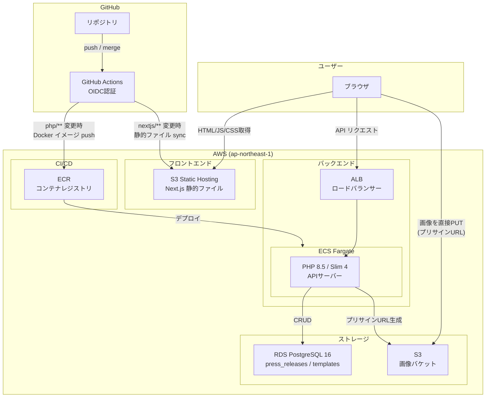
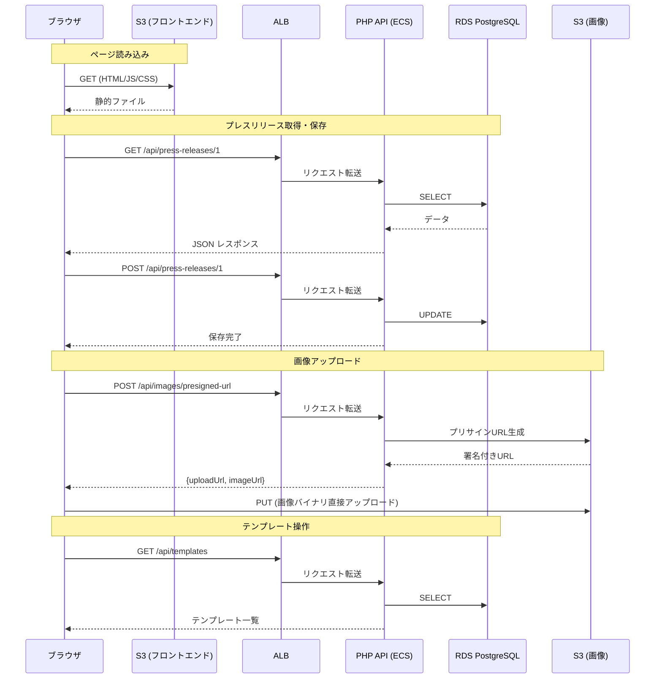

# early_riser

プレスリリースエディターアプリケーション

## URL

| 環境 | URL |
|------|-----|
| フロントエンド (S3) | http://early-riser-frontend-726725835302.s3-website-ap-northeast-1.amazonaws.com |
| バックエンド API (ALB) | http://early-riser-alb-771564224.ap-northeast-1.elb.amazonaws.com |

## API エンドポイント

| メソッド | パス | 説明 |
|----------|------|------|
| GET | `/api/press-releases/{id}` | プレスリリース取得 |
| POST | `/api/press-releases/{id}` | プレスリリース保存 |
| POST | `/api/images/presigned-url` | 画像アップロード用プリサインURL取得 |
| GET | `/api/templates` | テンプレート一覧取得 |
| POST | `/api/templates` | テンプレート保存 |
| DELETE | `/api/templates/{id}` | テンプレート削除 |
| GET | `/api/ogp?url=...` | OGP情報取得 (Next.js API Route) |
| GET | `/` | ヘルスチェック |

### フロントエンドからの fetch 例

```typescript
// プレスリリース取得
const res = await fetch("http://early-riser-alb-771564224.ap-northeast-1.elb.amazonaws.com/api/press-releases/1");
const data = await res.json();

// プレスリリース保存
await fetch("http://early-riser-alb-771564224.ap-northeast-1.elb.amazonaws.com/api/press-releases/1", {
  method: "POST",
  headers: { "Content-Type": "application/json" },
  body: JSON.stringify({ title: "タイトル", content: "コンテンツJSON" }),
});
```

### 画像アップロード（S3プリサインURL）

```typescript
// 1. プリサインURLを取得
const res = await fetch("http://early-riser-alb-771564224.ap-northeast-1.elb.amazonaws.com/api/images/presigned-url", {
  method: "POST",
  headers: { "Content-Type": "application/json" },
  body: JSON.stringify({ contentType: "image/png", fileName: "photo.png" }),
});
const { uploadUrl, imageUrl } = await res.json();

// 2. S3に直接アップロード
await fetch(uploadUrl, {
  method: "PUT",
  headers: { "Content-Type": "image/png" },
  body: file, // Fileオブジェクト
});

// 3. imageUrl をエディタに挿入
```

## アーキテクチャ


詳細な構成図: [architecture/AWS.drawio](architecture/AWS.drawio)

### システム構成図



### リクエストフロー



## 技術スタック

| レイヤー | 技術 |
|----------|------|
| フロントエンド | Next.js 16 (Static Export) / React / TipTap Editor |
| バックエンド | PHP 8.5 / Slim Framework 4 |
| データベース | PostgreSQL 16 (RDS) |
| インフラ | AWS (ECS Fargate, ALB, S3, RDS, ECR) |
| CI/CD | GitHub Actions (OIDC認証) |

## CI/CD

PRを main にマージすると自動デプロイが実行されます。

| ワークフロー | トリガー | デプロイ先 |
|-------------|----------|-----------|
| `deploy-backend.yml` | `webapp/php/**` の変更 | ECR → ECS Fargate |
| `deploy-frontend.yml` | `webapp/nextjs/**` の変更 | S3 Static Hosting |

## ローカル開発

```bash
# バックエンド
cd webapp/php
composer install
php -S localhost:8080 -t public

# フロントエンド
cd webapp/nextjs
npm install
npm run dev
```

## 環境変数

フロントエンド（ビルド時）:
- `NEXT_PUBLIC_API_URL` - バックエンド API の URL

バックエンド（ECS タスク定義 / GitHub Secrets & Variables）:
- `DB_HOST` / `DB_PORT` / `DB_DATABASE` / `DB_USERNAME` / `DB_PASSWORD`
- `APP_ENV` / `APP_KEY`
- `AWS_BUCKET_IMAGES` / `AWS_BUCKET_IMAGES_URL`
